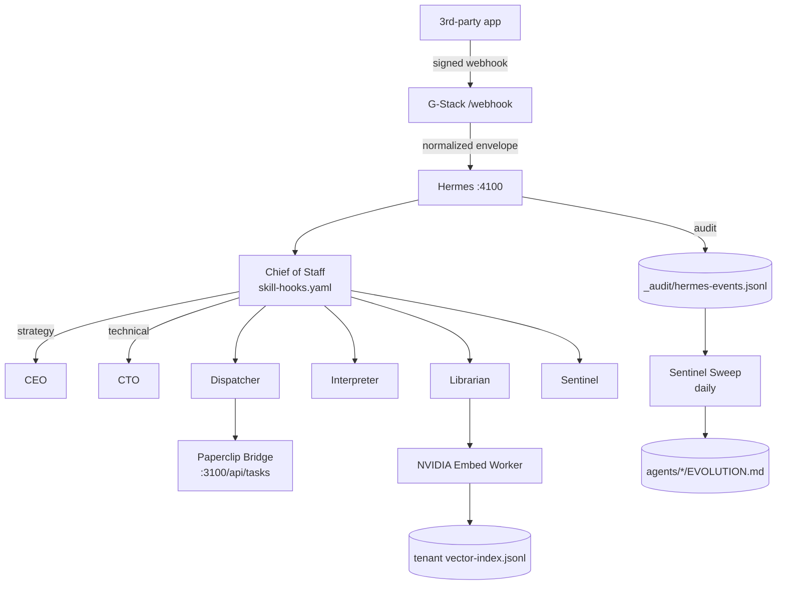

<div align="center">


</div>

<!-- readme-gen:start:badges -->
<div align="center">


</div>
<!-- readme-gen:end:badges -->

<!-- readme-gen:start:tech-stack -->
<p align="center">
  
</p>
<!-- readme-gen:end:tech-stack -->

<!-- readme-gen:start:social -->
<div align="center">


</div>
<!-- readme-gen:end:social -->

> **Run a business as if a senior team were watching it 24/7.** Snow Gloves OS is a reusable, tenant-scoped operations platform that wraps your tools (G-Stack connectors), your knowledge (NVIDIA embeddings), your judgement (an interpretation layer), and your action (Hermes + Paperclip orchestration) — so events don't get dropped, decisions are auditable, and risky actions are gated.


## ✨ Highlights

<table>
<tr>
<td width="50%" valign="top">

### 🧤 Hand-In-Glove
Seven specialized agents (CEO, CTO, Chief of Staff, Librarian, Interpreter, Dispatcher, Sentinel) work as one operations team — each with `IDENTITY · SOUL · TOOLS · SKILLS · HEARTBEAT · MEMORY · EVOLUTION`.

</td>
<td width="50%" valign="top">

### 🧭 Skill Orchestration
A dedicated **Chief of Staff** routes 60 skills via glob-matched hooks so CEO/CTO stay strategic. Add a skill → it's instantly callable across all agents.

</td>
</tr>
<tr>
<td width="50%" valign="top">

### 🔌 G-Stack Connector Fabric
Composio-like scoped connectors (Gmail, Calendar, Drive, Slack, PMS, Accounting, HRIS). Per-capability **risk + approval** flags. Webhooks signed and verified.

</td>
<td width="50%" valign="top">

### 🧠 NVIDIA Embeddings
Tenant-isolated vector index (`nv-embedqa-e5-v5`, 1024-dim). Plug into NVIDIA NIM with `NVIDIA_API_KEY`, or run offline with the deterministic stub backend.

</td>
</tr>
<tr>
<td width="50%" valign="top">

### 🛰️ Hermes Event Bus
Minimal HTTP listener on port `4100`. `POST /publish`, `GET /events`, `POST /test/e2e` for end-to-end smoke. Every event is append-logged for audit.

</td>
<td width="50%" valign="top">

### 🛡️ Sentinel Drift Sweep
Daily aggregation of hook usage, fallbacks, escalations, and top skills per agent. Auto-appended to each agent's `EVOLUTION.md` for self-improving loops.

</td>
</tr>
</table>


## 🚀 Quick Start

```bash
git clone https://github.com/Sheshiyer/snow-gloves-os.git
cd snow-gloves-os
./scripts/install.sh          # paperclipai + python deps
bash scripts/onboarding.sh    # interactive tenant onboarding
make smoke                    # full end-to-end smoke test
```

<details>
<summary><strong>Per-target Makefile</strong></summary>

| Target | Purpose |
|---|---|
| `make install` | Bootstrap (paperclipai + python deps) |
| `make onboard` | Interactive tenant onboarding |
| `make hermes` | Foreground Hermes listener on `:4100` |
| `make smoke` | Hermes → e2e → bridge dry-run → embed stub → sentinel |
| `make embed T=<tenant>` | Run NVIDIA embed worker (`QUIET=1` for cron) |
| `make sentinel` | Daily drift sweep |
| `make kill-hermes` | Free port 4100 |

</details>


<!-- readme-gen:start:architecture -->
## 🏗 Architecture



### Four reusable engines

| Engine | Owns | Files |
|---|---|---|
| **Connector** | G-Stack fabric, scopes, webhooks | `connectors/g-stack/` |
| **Knowledge** | Ingest, chunk, embed, retrieve | `scripts/ingest.py`, `scripts/embed_worker.py` |
| **Interpretation** | Skill routing, escalation | `workflows/skill-hooks.yaml`, `agents/chief-of-staff/` |
| **Orchestration** | Event bus + Paperclip bridge | `scripts/hermes.py`, `scripts/paperclip_bridge.py` |

<!-- readme-gen:end:architecture -->

<!-- readme-gen:start:tree -->
## 📂 Project Structure

```
📦 snow-gloves-os
├── 📂 .specify/                # Spec-Kit templates + workflows
├── 📂 .github/                 # Copilot prompts + agent configs
├── 📂 agents/                  # 7 agents, each with 8+ md files + MANIFEST
│   ├── 📂 ceo/                 # Strategy + leadership (10 skills)
│   ├── 📂 cto/                 # Architecture + execution (8 skills)
│   ├── 📂 chief-of-staff/      # Skill orchestrator (17 skills)
│   ├── 📂 librarian/           # Knowledge + retrieval (4 skills)
│   ├── 📂 interpreter/         # Narrative + copy (16 skills)
│   ├── 📂 dispatcher/          # Distribution + virality (3 skills)
│   └── 📂 sentinel/            # Audit + risk (2 skills)
├── 📂 connectors/g-stack/      # Capability registry + auth + webhooks
├── 📂 scripts/                 # install · hermes · ingest · embed · bridge · sentinel
├── 📂 workflows/               # skill-hooks.yaml — Chief of Staff graph
├── 📂 skills/                  # registry.yaml — 60-skill index
├── 📂 specs/                   # Spec-Kit features (001-hand-in-glove-platform)
├── 📂 docs/                    # Architecture + connector docs
├── 📂 tenants/                 # Per-tenant state (sources, bindings, indices)
├── 📂 _audit/                  # Append-only event log
├── 📄 config/snowgloves.yaml   # Runtime config (ports, embeddings, scopes)
└── 📄 Makefile                 # make smoke runs the whole loop
```
<!-- readme-gen:end:tree -->


<!-- readme-gen:start:health -->
## 📊 Project Health

| Category | Status | Score |
|:---------|:------:|------:|
| Spec coverage | ████████████████████ | 100% |
| Agents wired | ████████████████████ | 100% |
| Skill graph (60 skills) | ████████████████████ | 100% |
| End-to-end smoke | ████████████████████ | 100% |
| Real NVIDIA NIM integration | ████░░░░░░░░░░░░░░░░ |  20% |
| Live Paperclip wiring | ████░░░░░░░░░░░░░░░░ |  20% |
| Tests / CI | ░░░░░░░░░░░░░░░░░░░░ |   0% |
| Production hardening | ████░░░░░░░░░░░░░░░░ |  20% |

> **Overall: 67%** — Functional alpha; needs CI, tests, and real connector wiring before pilot.
<!-- readme-gen:end:health -->

## 🧪 Spec-Driven Development

This repo uses [GitHub Spec-Kit](https://github.com/github/spec-kit). Available slash commands (in Copilot/Codex chat):

```
/speckit.constitution    /speckit.specify    /speckit.clarify
/speckit.plan            /speckit.tasks      /speckit.analyze
/speckit.checklist       /speckit.implement  /speckit.taskstoissues
```

Active feature: [`specs/001-hand-in-glove-platform`](./specs/001-hand-in-glove-platform).

## 📜 Constitution

7 principles govern every change:

1. **Spec before code**
2. **Tenant isolation first**
3. **Interpretation before automation**
4. **Approval-gated risk**
5. **Auditability by default**
6. **Wiki as human control surface**
7. **Portable domain packs**

See [`.specify/memory/constitution.md`](./.specify/memory/constitution.md).

<!-- readme-gen:start:footer -->
<div align="center">


**Built with ❤️ by [Mage Narayan](https://github.com/Sheshiyer) · Thoughtseed Labs**

</div>
<!-- readme-gen:end:footer -->
