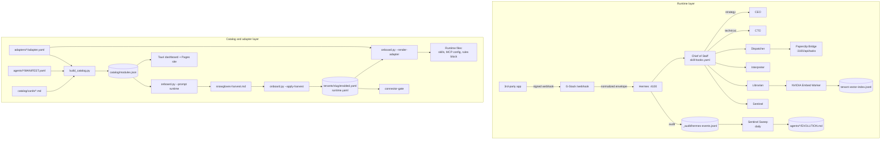

<div align="center">


# Snow Gloves OS

**Hand-In-Glove Business Operations Platform**

</div>

<!-- og:image: docs/assets/snowgloves-og.png (upload via repo Settings → Social preview) -->

<!-- readme-gen:start:badges -->
<div align="center">


</div>
<!-- readme-gen:end:badges -->

<!-- readme-gen:start:tech-stack -->
<p align="center">
  
</p>
<!-- readme-gen:end:tech-stack -->

<!-- readme-gen:start:social -->
<div align="center">


</div>
<!-- readme-gen:end:social -->

> **Run a business as if a senior team were watching it 24/7.** Snow Gloves OS is a reusable, tenant-scoped operations platform. It wraps your tools (G-Stack connectors), your knowledge (NVIDIA embeddings), your judgement (an interpretation layer), and your actions (Hermes + Paperclip orchestration), so events don't get dropped, decisions are auditable, and risky actions are gated. It is agent-agnostic: you pick the runtime (Claude Code, Codex, Cursor, OpenCode, Grok, Hermes, OpenClaw, or any other agent), and Snow Gloves renders its skills, MCP servers, and rules into that runtime's own format.

**Docs for new users:** [snow-gloves-wiki](https://snow-gloves-wiki.vercel.app) — how to use the app and the ecosystem (install, pick a runtime, onboard, modules, a quiet week). Slides, audio, and video live there. The [modules dashboard](https://sheshiyer.github.io/snow-gloves-os/) is the catalog, not the human guide.


## ✨ Highlights

<table>
<tr>
<td width="50%" valign="top">

### 🧤 Hand-In-Glove
Seven specialized agents (CEO, CTO, Chief of Staff, Librarian, Interpreter, Dispatcher, Sentinel) work as one operations team, each with `IDENTITY · SOUL · TOOLS · SKILLS · HEARTBEAT · MEMORY · EVOLUTION`.

</td>
<td width="50%" valign="top">

### 🧭 Skill Orchestration
A dedicated **Chief of Staff** routes 69 skills via glob-matched hooks so CEO/CTO stay strategic. Add a skill and it is callable across all agents.

</td>
</tr>
<tr>
<td width="50%" valign="top">

### 🗂 Modules & Catalog
130 catalog cards (skills, MCP servers, plugins, playbooks, connectors) harvested from X, Instagram, Field Theory, founders-kit, and marketingskills. Every card is a pointer with a disposition: `add`, `pointer`, `hold`, or `refuse`.

</td>
<td width="50%" valign="top">

### 🔀 Runtime Adapters
One `adapter.yaml` per runtime says where skills, MCP config, and rules live and which question tool drives plan mode. The founder picks the runtime; nothing is hard-wired to one agent.

</td>
</tr>
<tr>
<td width="50%" valign="top">

### 🔌 G-Stack Connector Fabric
Composio-like scoped connectors (Gmail, Calendar, Drive, Slack, PMS, Accounting, HRIS). Per-capability **risk + approval** flags. Webhooks signed and verified.

</td>
<td width="50%" valign="top">

### 🧠 NVIDIA Embeddings
Tenant-isolated vector index (`nv-embedqa-e5-v5`, 1024-dim). Plug into NVIDIA NIM with `NVIDIA_API_KEY`, or run offline with the deterministic stub backend.

</td>
</tr>
<tr>
<td width="50%" valign="top">

### 🛰️ Hermes Event Bus
Minimal HTTP listener on port `4100` (`scripts/hermes.py`). `POST /publish`, `GET /events`, `POST /test/e2e` for end-to-end smoke. Every event is append-logged to `_audit/hermes-events.jsonl`.

</td>
<td width="50%" valign="top">

### 🛡️ Sentinel Drift Sweep
Daily aggregation of hook usage, fallbacks, escalations, and top skills per agent. Auto-appended to each agent's `EVOLUTION.md` for self-improving loops.

</td>
</tr>
</table>


## 🚀 Quick Start

```bash
git clone https://github.com/Sheshiyer/snow-gloves-os.git
cd snow-gloves-os
./scripts/install.sh              # deps + print next steps (does not go live)
make doctor                       # pre-flight
make smoke                        # bus up, test event, stub embed, Sentinel
make onboard-prompt R=claude      # print the plan-mode interview for your runtime
make test                         # pytest
```

<details>
<summary><strong>Per-target Makefile</strong></summary>

| Target | Purpose |
|---|---|
| `make install` | Bootstrap (paperclipai + python deps) |
| `make doctor` | Pre-flight diagnostic |
| `make onboard` | Interactive tenant + sources prompt (legacy flow) |
| `make onboard-prompt R=<runtime>` | Print the plan-mode interview prompt for a runtime |
| `make catalog` / `make catalog-check` | Rebuild `catalog/modules.json` + `registry.yaml` / fail if stale |
| `make legacy-check` | Fail if pre-Hermes bus names remain (skips `.bak-*`) |
| `make site` | Build the static dashboard site (`npm run build:site`) |
| `make hermes` | Foreground Hermes listener on `:4100` |
| `make smoke` | Hermes → e2e → bridge dry-run → embed stub → sentinel |
| `make embed T=<tenant>` | Run NVIDIA embed worker (`QUIET=1` for cron) |
| `make sentinel` | Daily drift sweep |
| `make release-dry V=x.y.z` | Preview a platform version bump |
| `make release V=x.y.z` | Bump every version file, rebuild catalog, commit, tag (no push) |
| `make release-push V=x.y.z` | Push HEAD + tag, which triggers the release workflow |
| `make release-check` | Verify all version files agree with `VERSION` |
| `make upgrade [T=<slug>] [WRITE=1]` | Dry-run (or apply) tenant migrations |
| `make kill-hermes` | Free port 4100 |

</details>


<!-- readme-gen:start:architecture -->
## 🏗 Architecture


```mermaid
graph TD
  subgraph Runtime layer
    Ext[3rd-party app] -- signed webhook --> GS[G-Stack /webhook]
    GS -- normalized envelope --> Her[Hermes :4100]
    Her --> CoS[Chief of Staff<br/>skill-hooks.yaml]
    CoS -->|strategy| CEO
    CoS -->|technical| CTO
    CoS --> Lib[Librarian]
    CoS --> Int[Interpreter]
    CoS --> Dis[Dispatcher]
    CoS --> Sen[Sentinel]
    Dis --> PB[Paperclip Bridge<br/>:3100/api/tasks]
    Lib --> EW[NVIDIA Embed Worker]
    EW --> VI[(tenant vector-index.jsonl)]
    Her -- audit --> Log[(_audit/hermes-events.jsonl)]
    Log --> SS[Sentinel Sweep<br/>daily]
    SS --> Evo[(agents/*/EVOLUTION.md)]
  end

  subgraph Catalog and adapter layer
    Cards[catalog/cards/*.md] --> BC[build_catalog.py]
    Agents[agents/*/MANIFEST.yaml] --> BC
    Ad[adapters/*/adapter.yaml] --> BC
    BC --> MJ[(catalog/modules.json)]
    MJ --> Prompt[onboard.py --prompt runtime]
    Prompt --> Harvest[snowgloves-harvest.md]
    Harvest --> Apply[onboard.py --apply-harvest]
    Apply --> En[(tenants/slug/enabled.yaml<br/>runtime.yaml)]
    En --> Render[onboard.py --render-adapter]
    Ad --> Render
    Render --> RT[Runtime files:<br/>skills, MCP config, rules block]
    MJ --> Dash[Tauri dashboard + Pages site]
    En --> Gate[connector-gate]
  end
```

### Four reusable engines

| Engine | Owns | Files |
|---|---|---|
| **Connector** | G-Stack fabric, scopes, webhooks | `connectors/g-stack/`, `skills/connector-gate/` |
| **Knowledge** | Ingest, chunk, embed, retrieve | `scripts/ingest.py`, `scripts/embed_worker.py` |
| **Interpretation** | Skill routing, escalation | `workflows/skill-hooks.yaml`, `agents/chief-of-staff/` |
| **Orchestration** | Event bus + Paperclip bridge | `scripts/hermes.py`, `scripts/paperclip_bridge.py` |

More detail: [`docs/architecture-overview.md`](./docs/architecture-overview.md).

<!-- readme-gen:end:architecture -->

## 🗂 Modules & Catalog

`catalog/cards/<id>.md` holds one card per third-party skill, MCP server, plugin, connector, or playbook. A card is a pointer, never a copy of upstream code. `scripts/build_catalog.py` compiles the cards, the agent manifests, the adapters, and the G-Stack connectors into `catalog/registry.yaml` and `catalog/modules.json` (schema `snowgloves.modules.v1`). CI fails if either is stale.

| Disposition | Count | Meaning |
|---|---:|---|
| `add` | 59 | Tenant can enable it |
| `pointer` | 45 | Tenant can enable it as a reference; the host already provides it |
| `hold` | 14 | Visible, not enableable until the founder picks it and it passes review |
| `refuse` | 12 | Visible, never enableable |

By category: skills 77, playbook 36, plugin 13, mcp 3, connector 1. Card schema and dispositions: [`docs/catalog.md`](./docs/catalog.md). Where the cards came from: [`docs/research/2026-09-29-ecosystem-review.md`](./docs/research/2026-09-29-ecosystem-review.md).

## 🔀 Runtime Adapters & Onboarding

Snow Gloves does not assume an agent. Each runtime has `adapters/<runtime>/adapter.yaml` (schema `snowgloves.adapter.v1`): skill, MCP, and rules paths; file formats; the runtime's question tool; and how to enter plan mode. Shipped adapters: `hermes`, `claude`, `codex`, `cursor`, `opencode`, `grok`, `openclaw`, `muse`, `generic`. Fields nobody has confirmed against the real runtime are marked `verify: true` and reported on every render. The Muse adapter is a guess throughout.

Onboarding is a plan-mode interview run inside the project the founder has been building:

```bash
make onboard-prompt R=cursor                                        # 1. interview → snowgloves-harvest.md
python3 scripts/onboard.py --apply-harvest snowgloves-harvest.md --tenant acme   # 2. apply
python3 scripts/onboard.py --list --category skills                 # 3. adjust
python3 scripts/onboard.py --enable ms-copywriting --tenant acme
python3 scripts/onboard.py --render-adapter cursor --tenant acme    # 4. render (dry run)
python3 scripts/onboard.py --render-adapter cursor --tenant acme --write
```

The agent asks one decision at a time, takes options only from `modules.json`, and writes `FILL:` instead of guessing. See [`docs/onboarding.md`](./docs/onboarding.md) and [`docs/adapters.md`](./docs/adapters.md).

## 🖥 Dashboard

The native Tauri v2 app in [`apps/onboarding/`](./apps/onboarding) gains a **Modules dashboard** and a guided onboarding flow. Both read the same `catalog/modules.json` plus each tenant's `enabled.yaml`. The same data is published as a static site, built with `make site` (`npm run build:site`) and deployed by GitHub Pages:

**https://sheshiyer.github.io/snow-gloves-os/**

```bash
make app-install   # one-time: npm install
make app-dev       # launch in dev mode (hot-reload frontend)
make app-build     # produce a signable release bundle
make site          # build the static Pages site locally
```

See [its README](./apps/onboarding/README.md) for the IPC surface and capability list.

## 📦 Release & Upgrade

The root `VERSION` file (currently `0.2.0`) is the platform version. The app's `package.json`, `tauri.conf.json`, `Cargo.toml`, both lockfiles, and `distribution.yaml` are kept in lockstep with it, and `catalog/modules.json` embeds it.

```bash
make release-dry V=0.2.1    # show every file that would change
make release V=0.2.1        # bump, rebuild catalog, finalize CHANGELOG, commit, tag v0.2.1
make release-push V=0.2.1   # push; CI builds the signed app + attaches platform assets
make upgrade                # dry-run tenant migrations to VERSION
make upgrade T=acme WRITE=1 # apply, rebuild catalog, re-render acme's adapters
```

A release ships the signed Tauri installers with the OTA manifest, plus a platform job that attaches the source tarball, `modules.json`, the adapter bundle, and `SHA256SUMS`. See [`docs/RELEASING.md`](./docs/RELEASING.md) and [`docs/UPGRADING.md`](./docs/UPGRADING.md).

<!-- readme-gen:start:tree -->
## 📂 Project Structure

```
📦 snow-gloves-os
├── 📄 VERSION                  # platform version (0.2.0)
├── 📄 distribution.yaml        # what the platform owns vs what tenants own
├── 📂 .github/workflows/       # ci.yml (pytest, version + catalog checks, smoke) · release.yml · pages.yml
├── 📂 .specify/                # Spec-Kit templates + workflows
├── 📂 .planning/               # GSD state (STATE.md, PROJECT.md)
├── 📂 agents/                  # 7 agents, each with 8+ md files + MANIFEST
├── 📂 adapters/                # one adapter.yaml per runtime (9)
├── 📂 catalog/                 # SCHEMA.md · cards/ (130) · registry.yaml · modules.json (generated)
├── 📂 prompts/                 # onboard-interview.md (plan-mode interview template)
├── 📂 migrations/              # v0_1_to_v0_2.py (bus rename to Hermes)
├── 📂 apps/onboarding/         # Tauri v2 app: onboarding + Modules dashboard, Pages site
├── 📂 connectors/g-stack/      # Capability registry + auth + webhooks
├── 📂 scripts/                 # hermes · ingest · embed · bridge · sentinel · build_catalog · onboard · release · upgrade
├── 📂 skills/                  # registry.yaml (69 routed skills) · connector-gate · sg-onboard · tn-seed · gtm-brief-synthesis
├── 📂 workflows/               # skill-hooks.yaml — Chief of Staff graph
├── 📂 specs/                   # Spec-Kit features
├── 📂 docs/                    # architecture, catalog, adapters, onboarding, releasing, upgrading, research, runbooks
├── 📂 tenants/                 # Per-tenant state (context, enabled.yaml, runtime.yaml, sources, indices)
├── 📂 tests/                   # pytest suite
├── 📂 _audit/                  # Append-only event log
├── 📄 config/snowgloves.yaml   # Runtime config (ports, embeddings, scopes)
└── 📄 Makefile                 # make smoke runs the whole loop
```
<!-- readme-gen:end:tree -->


<!-- readme-gen:start:health -->
## 📊 Project Health

| Category | Status | Score |
|:---------|:------:|------:|
| Spec coverage | ████████████████████ | 100% |
| Agents wired | ████████████████████ | 100% |
| End-to-end smoke | ████████████████████ | 100% |
| Tests / CI (119 pytest tests; CI runs pytest, version + catalog checks, smoke) | ████████████████░░░░ |  80% |
| Catalog (130 cards, `--check` in CI) | ████████████████░░░░ |  80% |
| Runtime adapters (9 shipped; several fields still `verify: true`) | ██████████░░░░░░░░░░ |  50% |
| Release + upgrade tooling (v0.2.0 not yet published) | ████████████░░░░░░░░ |  60% |
| Real NVIDIA NIM integration | ████░░░░░░░░░░░░░░░░ |  20% |
| Live Paperclip wiring | ████░░░░░░░░░░░░░░░░ |  20% |
| Production hardening | ████░░░░░░░░░░░░░░░░ |  20% |

> **Overall: 63%** — Functional alpha with real tests and CI. Before pilot: confirm the unverified adapter fields, publish v0.2.0, and wire real connectors, NIM, and Paperclip.
<!-- readme-gen:end:health -->

### Open items

- **Bundle id (decided).** The app id is `com.tryambakam.snowgloves.onboarding` (was `com.thoughtseed.snowgloves.onboarding`). v0.2.0 is a new app: existing 0.1.x users must reinstall from the DMG/MSI; OTA will not find 0.2.0.
- **`distribution.yaml` lacks `hermes_requires`.** Nothing declares which Hermes version or port a distribution needs yet. Do not set it in this release.
- **Unverified adapter fields.** Muse is a guess throughout; the OpenClaw question tool and plan mode, and Codex `/plan`, are unconfirmed. See [`docs/adapters.md`](./docs/adapters.md).

## 🧪 Spec-Driven Development

This repo uses [GitHub Spec-Kit](https://github.com/github/spec-kit). Available slash commands (in Copilot/Codex chat):

```
/speckit.constitution    /speckit.specify    /speckit.clarify
/speckit.plan            /speckit.tasks      /speckit.analyze
/speckit.checklist       /speckit.implement  /speckit.taskstoissues
```

Active feature: [`specs/001-hand-in-glove-platform`](./specs/001-hand-in-glove-platform).

## 📜 Constitution

7 principles govern every change:

1. **Spec before code**
2. **Tenant isolation first**
3. **Interpretation before automation**
4. **Approval-gated risk**
5. **Auditability by default**
6. **Wiki as human control surface**
7. **Portable domain packs**

See [`.specify/memory/constitution.md`](./.specify/memory/constitution.md).

<!-- readme-gen:start:footer -->
<div align="center">


**Built with ❤️ by [Mage Narayan](https://github.com/Sheshiyer) · Tryambakam Noesis**

</div>
<!-- readme-gen:end:footer -->
