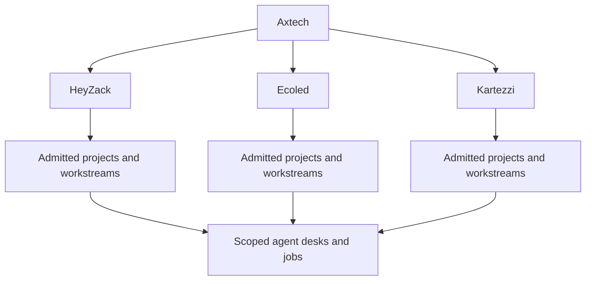

# Axtech portfolio organization — corrected scope

This organization covers only Axtech and its operating branches. Initial branches from the existing workspace draft are HeyZack, Ecoled and Kartezzi. Legal company names, exact ownership links and branch project inventories remain source-backed intake decisions.

The common desk box represents reusable definitions; each admitted instance has separate branch/project authority. Mapping sequence: Axtech → branch → project → workstream → desk/job. Editorial, creative-production, delivery and growth are proposed desks. CEO, CTO, Chief of Staff, Librarian, Interpreter, Dispatcher and Sentinel remain reusable Snow Gloves control roles scoped to the admitted operation.

The founder's correction replaces the earlier mixed-session portfolio map. No unrelated business, brand inventory or private editorial job belongs in this packet. Existing independent systems are outside this organization scope.

Review packet: specs/006-editorial-steward-integration/{spec,plan,tasks}.md, organization.json and portfolio-map-proposal.json. The directory name is retained for continuity; its active contents now specify Axtech-only integration. No runtime or tenant activation occurred.
