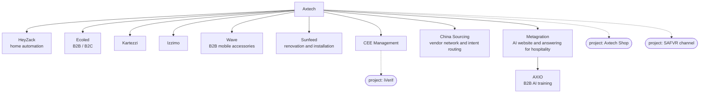

# Axtech portfolio organization

This organization covers Axtech and its branches only. The founder confirmed the branch list on 2026-10-05
(`specs/006-editorial-steward-integration/founder-intake-2026-10-05.md`). Legal company names, domains and
ownership links remain intake decisions; a position on this map is an operating scope, not a cap table.

Solid lines are tenants (`tenants/<slug>/`, isolation strict). Dotted lines are projects inside a tenant
(`projects` in `specs/006-editorial-steward-integration/portfolio-map-proposal.json`). A unit gets its own
tenant when it has its own customers or holds data that must be walled off; China Sourcing is a tenant for
that second reason.

Cross-brand work is allowed only through a named rule. Three flows are proposed, none approved
(`cross_brand_flows` in the proposal): the heat-pump chain (CEE Management, Axtech Shop, Sunfeed, iVerif),
the shop reading brand product catalogs, and China Sourcing routing purchase intent.

Mapping sequence: Axtech → branch → project → workstream → desk/job. Editorial, creative-production,
delivery and growth are proposed desks. CEO, CTO, Chief of Staff, Librarian, Interpreter, Dispatcher and
Sentinel remain reusable Snow Gloves control roles scoped to the admitted operation.

Review packet: `specs/006-editorial-steward-integration/{spec,plan,tasks}.md`, `organization.json`,
`portfolio-map-proposal.json` and `founder-intake-2026-10-05.md`. No runtime or tenant activation occurred.
