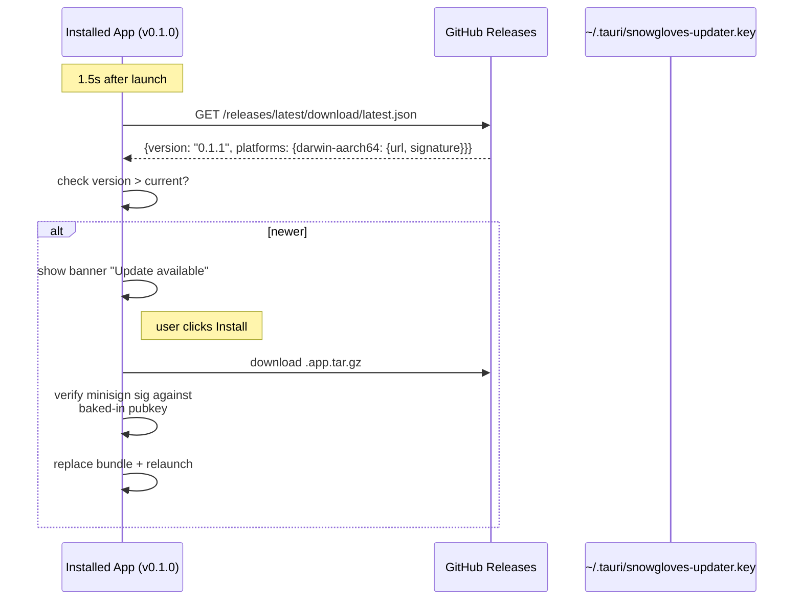

# Releasing Snow Gloves Onboarding

This document explains how to cut a signed, auto-updatable release of the desktop wizard.

---

## One-time setup — GitHub secrets

You need to set these 8 secrets in **Settings → Secrets and variables → Actions** of the repo.

### A. Tauri OTA updater (required for auto-update)

| Secret | Value | Source |
|---|---|---|
| `TAURI_SIGNING_PRIVATE_KEY` | full contents of `~/.tauri/snowgloves-updater.key` | `cargo tauri signer generate` |
| `TAURI_SIGNING_PRIVATE_KEY_PASSWORD` | passphrase (empty string `""` if you generated without `-p`) | — |

> 🔒 If you lose the updater private key, every installed copy of the app stops receiving updates. Back this up in 1Password / a Yubikey. The corresponding `pubkey` is baked into `tauri.conf.json` and tied to all existing installs — rotating it requires a force re-install for every user.

### B. macOS code signing (required for Gatekeeper-pleasant install)

| Secret | Value | How to get it |
|---|---|---|
| `APPLE_CERTIFICATE` | base64 of `.p12` export of your Developer ID Application cert | Keychain → right-click cert → Export → .p12 → `base64 -i cert.p12 \| pbcopy` |
| `APPLE_CERTIFICATE_PASSWORD` | password used when exporting the .p12 | — |
| `APPLE_SIGNING_IDENTITY` | `Developer ID Application: Thoughtseed Private Limited (BS6SZR4929)` | `security find-identity -v -p codesigning` |
| `KEYCHAIN_PASSWORD` | any password (just unlocks the temp keychain in CI) | e.g. `openssl rand -base64 24` |

### C. macOS notarization (required for the app to launch on other Macs without scary dialogs)

| Secret | Value | How to get it |
|---|---|---|
| `APPLE_ID` | the Apple ID email used to enroll in the Developer Program | — |
| `APPLE_PASSWORD` | **app-specific password** (NOT your real Apple password) | https://appleid.apple.com → Security → App-Specific Passwords → generate |
| `APPLE_TEAM_ID` | `BS6SZR4929` (Thoughtseed) | https://developer.apple.com/account → Membership |

---

## Cutting a release

### Option 1 — local tag push (recommended)
```bash
# bump version
sed -i '' 's/"version": "0.1.0"/"version": "0.1.1"/' apps/onboarding/package.json apps/onboarding/src-tauri/tauri.conf.json apps/onboarding/src-tauri/Cargo.toml
git commit -am "chore(release): v0.1.1"

# cut the release
make release-tag V=0.1.1
# → pushes tag v0.1.1 → CI builds macOS universal + Windows + Linux → draft release with latest.json
```

### Option 2 — workflow dispatch
```bash
make release-dispatch V=0.1.1
```

### Option 3 — pure git
```bash
git tag -a v0.1.1 -m "release: v0.1.1" && git push origin v0.1.1
```

---

## What CI does (`.github/workflows/release.yml`)

1. **Matrix builds:** macOS universal (`aarch64+x86_64`), Ubuntu 22.04, Windows latest
2. **macOS:** imports your Developer ID cert into a temp keychain, codesigns, then notarizes via `notarytool`
3. **All platforms:** runs `cargo tauri build` which produces:
   - `.dmg` (mac) / `.msi` + `.exe` (win) / `.deb` + `.rpm` + `.AppImage` (linux)
   - `.tar.gz` + `.tar.gz.sig` (mac updater archive)
   - `.nsis.zip` + `.nsis.zip.sig` (win updater archive)
   - `.AppImage.tar.gz` + `.sig` (linux updater archive)
4. **Updater manifest:** `tauri-action` aggregates per-platform sigs into `latest.json` and uploads to the GitHub Release
5. **Output:** draft release at https://github.com/Sheshiyer/snow-gloves-os/releases — **review and publish manually**

---

## How OTA works



**Failure modes:**
- `latest.json` 404 → user stays on current version (no error)
- Signature mismatch → update is **refused** (this is the whole point of the keypair)
- Network down → silently skipped, retries next launch

---

## Local development

```bash
make app-install   # npm ci + first cargo build
make app-dev       # vite + tauri dev (hot reload)
make app-build     # local signed build (no notarization)
```

To do a **fully signed local build** (matches CI output exactly except notarization):
```bash
cd apps/onboarding
export TAURI_SIGNING_PRIVATE_KEY=$(cat ~/.tauri/snowgloves-updater.key)
export TAURI_SIGNING_PRIVATE_KEY_PASSWORD=""
export APPLE_SIGNING_IDENTITY="Developer ID Application: Thoughtseed Private Limited (BS6SZR4929)"
npx tauri build
# → src-tauri/target/release/bundle/
```

---

## Bumping versions

The three files that must agree:
| File | Field |
|---|---|
| `apps/onboarding/package.json` | `version` |
| `apps/onboarding/src-tauri/tauri.conf.json` | `version` |
| `apps/onboarding/src-tauri/Cargo.toml` | `[package].version` |

The tag must match: `v0.1.1` → all three files should be `0.1.1`.
