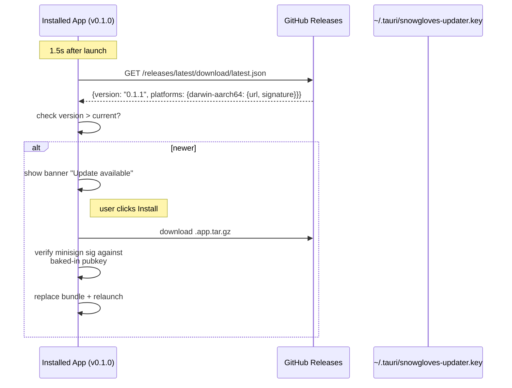

# Releasing Snow Gloves OS

A release covers two things that share one version number:

- **The platform**: agents, catalog, adapters, prompts, migrations, scripts. Shipped as a source tarball, `modules.json`, an adapter bundle, and `SHA256SUMS`.
- **The app**: the signed, auto-updating Tauri desktop app in `apps/onboarding/` (onboarding + Modules dashboard).

The root `VERSION` file is the single source of truth. `scripts/release.py` keeps every other version field in lockstep with it.

---

## One-time setup — GitHub secrets

The platform job needs no secrets. The app build needs these 8 secrets in **Settings → Secrets and variables → Actions** of the repo.

### A. Tauri OTA updater (required for auto-update)

| Secret | Value | Source |
|---|---|---|
| `TAURI_SIGNING_PRIVATE_KEY` | full contents of `~/.tauri/snowgloves-updater.key` | `cargo tauri signer generate` |
| `TAURI_SIGNING_PRIVATE_KEY_PASSWORD` | passphrase (empty string `""` if you generated without `-p`) | — |

> 🔒 If you lose the updater private key, every installed copy of the app stops receiving updates. Back this up in 1Password / a Yubikey. The corresponding `pubkey` is baked into `tauri.conf.json` and tied to all existing installs — rotating it requires a force re-install for every user.

### B. macOS code signing (required for Gatekeeper-pleasant install)

| Secret | Value | How to get it |
|---|---|---|
| `APPLE_CERTIFICATE` | base64 of `.p12` export of your Developer ID Application cert | Keychain → right-click cert → Export → .p12 → `base64 -i cert.p12 \| pbcopy` |
| `APPLE_CERTIFICATE_PASSWORD` | password used when exporting the .p12 | — |
| `APPLE_SIGNING_IDENTITY` | `Developer ID Application: Thoughtseed Private Limited (BS6SZR4929)` — cert CN verbatim; team approved for Snow Gloves signing under owner ruling R3. Do NOT re-word this string, codesign matches it exactly. | `security find-identity -v -p codesigning` |
| `KEYCHAIN_PASSWORD` | any password (just unlocks the temp keychain in CI) | e.g. `openssl rand -base64 24` |

### C. macOS notarization (required for the app to launch on other Macs without scary dialogs)

| Secret | Value | How to get it |
|---|---|---|
| `APPLE_ID` | the Apple ID email used to enroll in the Developer Program | — |
| `APPLE_PASSWORD` | **app-specific password** (NOT your real Apple password) | https://appleid.apple.com → Security → App-Specific Passwords → generate |
| `APPLE_TEAM_ID` | `BS6SZR4929` (kept per owner ruling R3 — cert issued to Thoughtseed Private Limited, team approved for Snow Gloves / Tryambakam Noesis signing) | https://developer.apple.com/account → Membership |

---

## Version files

`scripts/release.py` reads and writes all of these. `make release-check` (and CI) fails if any disagree with `VERSION`.

| File | Field |
|---|---|
| `VERSION` | whole file (source of truth) |
| `apps/onboarding/package.json` | `version` |
| `apps/onboarding/package-lock.json` | root `version` and `packages[""].version` |
| `apps/onboarding/src-tauri/tauri.conf.json` | `version` |
| `apps/onboarding/src-tauri/Cargo.toml` | `[package].version` (dependency versions are left alone) |
| `apps/onboarding/src-tauri/Cargo.lock` | the `snowgloves-onboarding` package entry |
| `distribution.yaml` | `version` |
| `catalog/modules.json` | `version`, regenerated by `scripts/build_catalog.py` |
| `CHANGELOG.md` | must have a `## vX.Y.Z` section |

The tag must match: `v0.2.1` means every file above says `0.2.1`.

---

## Cutting a release

```bash
# 0. clean tree, on main, tests green
python3 -m pytest -q
make catalog-check

# 1. preview: prints a diff of every file that would change, writes nothing
make release-dry V=0.2.1

# 2. bump + commit + tag (never pushes)
make release V=0.2.1

# 3. push the commit and the tag; this starts .github/workflows/release.yml
make release-push V=0.2.1
```

What `make release V=x.y.z` (`scripts/release.py x.y.z --commit --tag`) does:

1. Rejects anything that is not semver.
2. Writes the new version into every version file above.
3. Updates `CHANGELOG.md`: if a `## vX.Y.Z … (unreleased)` heading exists it is finalized with today's date; otherwise a new section is prepended from the commit subjects since the last tag.
4. Runs `scripts/build_catalog.py` so `catalog/modules.json` and `catalog/registry.yaml` carry the new version and `build_catalog.py --check` stays clean.
5. Commits the changed files as `release: vX.Y.Z` and creates an annotated tag `vX.Y.Z`. It refuses to re-create an existing tag.

`--dry-run` prints the diff and the catalog command it would run, and writes nothing. Without `--commit` / `--tag`, `scripts/release.py x.y.z` only writes the files.

Other ways to start the workflow for a tag that is already pushed:

```bash
make release-dispatch V=0.2.1        # gh workflow run release.yml -f tag=v0.2.1
```

`make release-tag V=…` (tag + push in one step, no version bump) still exists for re-tagging, but prefer `make release` so the version files cannot drift.

---

## What CI does (`.github/workflows/release.yml`)

### `build` job (app, matrix)

1. **Matrix builds:** macOS universal (`aarch64+x86_64`), Ubuntu 22.04, Windows latest
2. **macOS:** imports your Developer ID cert into a temp keychain, codesigns, then notarizes via `notarytool` (unsigned with a warning if `APPLE_CERTIFICATE` is not set)
3. **All platforms:** `tauri-action` builds:
   - `.dmg` (mac) / `.msi` + `.exe` (win) / `.deb` + `.rpm` + `.AppImage` (linux)
   - `.tar.gz` + `.tar.gz.sig` (mac updater archive)
   - `.nsis.zip` + `.nsis.zip.sig` (win updater archive)
   - `.AppImage.tar.gz` + `.sig` (linux updater archive)
4. **Updater manifest:** `tauri-action` aggregates per-platform sigs into `latest.json` and uploads it to the GitHub Release
5. **Output:** a draft release at https://github.com/Sheshiyer/snow-gloves-os/releases

### `platform` job

Runs after `build` (even if a platform failed) and needs no Apple secrets:

1. `scripts/release.py --check --expect $TAG` — fails if `VERSION`, the app files, `modules.json`, or the CHANGELOG disagree with the tag
2. `scripts/build_catalog.py` — rebuilds `modules.json`
3. `scripts/release.py --bundle dist` — writes `snow-gloves-os-X.Y.Z-src.tar.gz` (from `git archive`), `modules.json`, `snow-gloves-os-X.Y.Z-adapters.tar.gz`, and `SHA256SUMS`
4. Uploads them to the same draft release (creating it if the app build did not)

**Review the draft and publish it manually.** OTA clients only see a release once it is published.

### `ci.yml` (every push and PR to main)

Python deps come from `requirements-ci.txt` (so `setup-python` pip cache has a lock file). Jobs: pytest, `release.py --check`, `build_catalog.py --check`, `make walk`, and `make smoke` (Hermes, e2e event, bridge dry-run, embed stub, sentinel).

### `pages.yml`

Builds the static dashboard site (`make site`, i.e. `npm run build:site` in `apps/onboarding/`) and deploys it to https://sheshiyer.github.io/snow-gloves-os/. Runs on `main` and on `v*` tags. Repo Settings → Pages must use **GitHub Actions** as the source.

The GitHub Release for a tag starts as a **draft** (`releaseDraft: true`). Review assets, then publish. OTA clients only see a published release. **v0.2.0 does not OTA from 0.1.x** (new bundle id).

---

## How OTA works


```mermaid
sequenceDiagram
  participant U as Installed App (v0.1.0)
  participant GH as GitHub Releases
  participant K as ~/.tauri/snowgloves-updater.key
  Note over U: 1.5s after launch
  U->>GH: GET /releases/latest/download/latest.json
  GH-->>U: {version: "0.1.1", platforms: {darwin-aarch64: {url, signature}}}
  U->>U: check version > current?
  alt newer
    U->>U: show banner "Update available"
    Note right of U: user clicks Install
    U->>GH: download .app.tar.gz
    U->>U: verify minisign sig against<br/>baked-in pubkey
    U->>U: replace bundle + relaunch
  end
```

**Failure modes:**
- `latest.json` 404 → user stays on current version (no error)
- Signature mismatch → update is **refused** (this is the whole point of the keypair)
- Network down → silently skipped, retries next launch

---

## Bundle identifier (decided)

The app bundle id is **`com.tryambakam.snowgloves.onboarding`** (`apps/onboarding/src-tauri/tauri.conf.json` → `identifier`), re-branded from the former `com.thoughtseed.snowgloves.onboarding`. Treat **v0.2.0 as a new app**. Existing **0.1.x** installs will not receive this release over OTA; users must download the new DMG/MSI and reinstall. Do not test-and-hope the updater.

macOS treats a new bundle id as a different app (separate preferences, keychain items, and app data). The Apple signing team (`BS6SZR4929`) is unchanged and approved for Snow Gloves signing under owner ruling R3; the signing identity string above must stay byte-identical to the certificate CN in the keychain.

---

## Local development

```bash
make app-install   # npm install
make app-dev       # vite + tauri dev (hot reload)
make app-build     # local signed build (no notarization)
make site          # static Pages build
```

To do a **fully signed local build** (matches CI output exactly except notarization):
```bash
cd apps/onboarding
export TAURI_SIGNING_PRIVATE_KEY=$(cat ~/.tauri/snowgloves-updater.key)
export TAURI_SIGNING_PRIVATE_KEY_PASSWORD=""
export APPLE_SIGNING_IDENTITY="Developer ID Application: Thoughtseed Private Limited (BS6SZR4929)"  # cert CN verbatim — team approved per owner ruling R3; do not re-word
npx tauri build
# → src-tauri/target/release/bundle/
```

---

## After publishing

Tenants are not changed by a release. Operators run `make upgrade` (dry run), then `make upgrade WRITE=1`, to migrate tenant files to the new version. See [UPGRADING.md](./UPGRADING.md).
