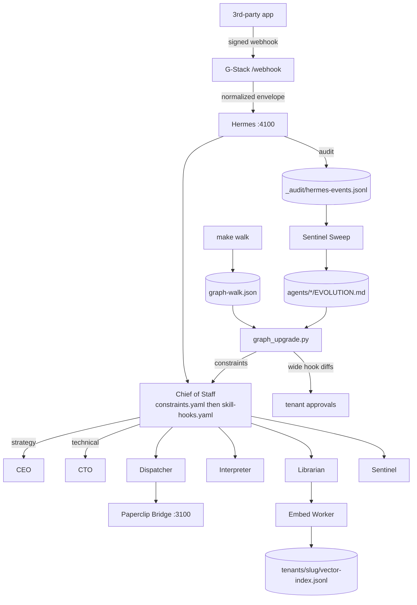
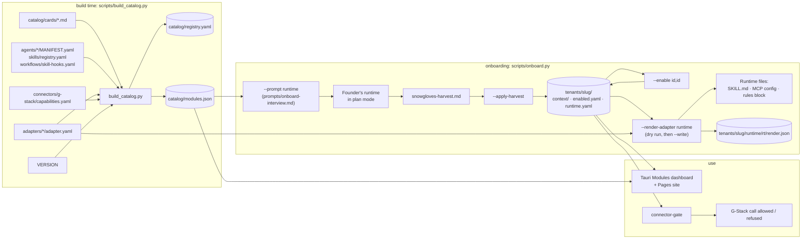

# Snow Gloves OS: Architecture Overview

Snow Gloves OS has two halves. The **runtime layer** is what runs a business day to day: connectors, the Hermes event bus, seven agents, embeddings, and the audit trail. The **catalog and adapter layer** decides what a tenant is allowed to use and renders it into whichever agent runtime the founder picked.

## Core stack

- **Connector layer:** G-Stack (secure, scoped connectors), gated per tenant by `skills/connector-gate`
- **Knowledge layer:** wiki/doc ingestion + vector retrieval (`scripts/ingest.py`). Ingest feeds workers (Librarian index). It does **not** mutate `workflows/skill-hooks.yaml`.
- **Embedding layer:** NVIDIA-compatible embedding abstraction (`scripts/embed_worker.py`, stub backend offline)
- **Interpretation layer:** entity/policy/confidence synthesis, skill routing in `workflows/skill-hooks.yaml` with `workflows/constraints.yaml` loaded first
- **Orchestration layer:** Hermes (`scripts/hermes.py`, port 4100) + Paperclip bridge (port 3100)
- **Memory layer:** wiki/audit/trace synchronization (`_audit/hermes-events.jsonl`, `agents/*/EVOLUTION.md`)
- **Learning edge:** `scripts/graph_upgrade.py` (dry-run default) turns walk REDs, Sentinel drift, and tenant `enabled.yaml` (`add`/`pointer` only) into splitter **constraints**. Hook diffs for the shared skill graph are wide blast radius and need an approvals ticket unless `approval_mode: allow-graph-write`.
- **Catalog layer:** `catalog/cards/*.md` compiled to `catalog/modules.json`
- **Adapter layer:** `adapters/<runtime>/adapter.yaml`, rendered by `scripts/onboard.py`

## Runtime flow

## Catalog and adapter flow

Rules the flow enforces:

- **Cards are pointers.** No upstream code is vendored. Only `add` and `pointer` cards can be enabled; `hold` and `refuse` are shown but refused by `--enable` and `--apply-harvest`.
- **One source of truth for options.** The interview, the dashboard, the Pages site, and `--enable` all read `modules.json`. CI fails if it is stale (`build_catalog.py --check`) or if its version differs from `VERSION` (`release.py --check`).
- **Renders never clobber runtime config.** JSON MCP files are merged, TOML tables are appended only when missing, YAML config gets a sibling `.snowgloves` fragment, and markdown rules get a `<!-- snowgloves:start -->` … `<!-- snowgloves:end -->` block. Every render is a dry run unless `--write` is passed.
- **Unverified adapter fields are loud.** Any field under `verify:` in an adapter is listed in the render notes and in `render.json`.

## Graph and loop

Routing is a **graph**. The loop lives **inside** a node. Mini proof is `make walk`, then optional `make graph-upgrade` (dry-run). Source: [hanakoxbt / Loops and Graphs](https://x.com/hanakoxbt/status/2091515787366306154).

| Idea | In this repo |
|---|---|
| Splitter | `route()` in `scripts/hermes.py`: `workflows/constraints.yaml` first, then `workflows/skill-hooks.yaml` |
| Loop | `scripts/graph_walk.py` inner loop: produce an artifact, machine-check it, retry **that unit** up to 3 times. No second model. |
| Correction edge | RED is `UNIT` / `VERDICT` / `REASON` / `EVIDENCE` / `SCOPE` (unit, not batch rewind) |
| Learning edge | `scripts/graph_upgrade.py` writes constraints (derived rules). Hook-file edits are wide blast radius → approvals ticket |
| Report | Sentinel `EVOLUTION.md` drift that does not change what runs next |
| Gate | `skills/connector-gate` plus tenant `approvals/` |

`make upgrade` is still platform VERSION migrations. `make graph-upgrade` is the splitter learning path. Cards with `hold` / `refuse` never get hook diffs. inference-sh and Explee skills are pointers on a walk receipt, not a fake GREEN.

## Versioning and upgrade

`VERSION` is the platform version. `scripts/release.py` keeps the app manifests, lockfiles, `distribution.yaml`, and `catalog/modules.json` in lockstep. Tenants record the version they were migrated to in `tenants/<slug>/.snowgloves-version`; `scripts/upgrade.py` runs `migrations/v*_to_v*.py` to bring them forward. See [RELEASING.md](./RELEASING.md) and [UPGRADING.md](./UPGRADING.md).

## Why this works across businesses

- Standardized event and interpretation contracts
- Tenant-isolated context, permissions, and enabled modules
- Reusable domain packs and a shared catalog
- Runtime-agnostic: adapters, not hard-coded agents
- Approval-gated operations with full traceability
