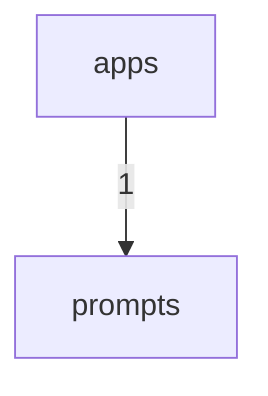

# Dependency Graph

> Auto-generated by `ArchitectureAssetsSync.hook.ts`. Last refreshed: 2026-10-08T15:37:31.244Z
> Scanned 81 source files. Edges aggregate to top-level directories (or `src/<name>`).

## Module graph

## Edge counts

| From | To | Imports |
|---|---|---|
| `apps` | `prompts` | 1 |