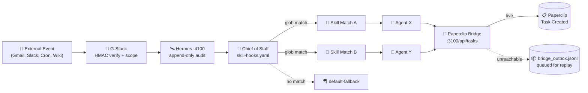
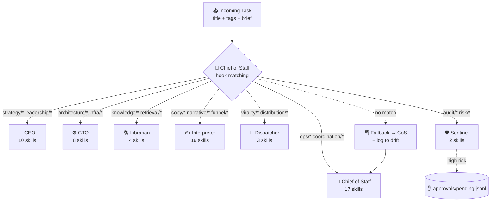
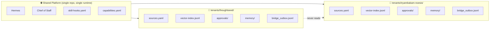
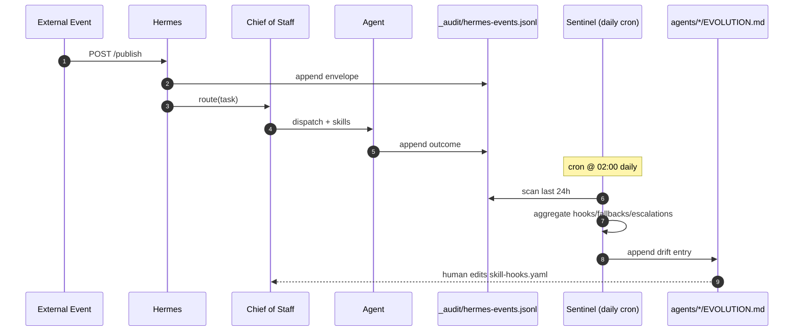

<div align="center">


# Snow Gloves OS — The Explainer

**A 5-minute tour of why this exists, what it does, and how an event travels through it.**

</div>

---

## 1 · Why "Snow Gloves"?

> Running a small business feels like trying to play piano with oven mitts on.

You have the tools (Gmail, Calendar, Drive, a PMS, an accounting app). You have the knowledge (a wiki, a Notion, a head full of context). You have the judgement (what to do when a refund request comes in at 11pm on a Sunday). But none of it composes. Things slip through the cracks. Senior decisions get made by whoever happened to see the email first.

**Snow Gloves OS is a thin, perfectly-fitted layer that wraps your business** — like a glove on a hand. It doesn't replace the hand. It makes the hand precise.

- 🧤 **Hand** = your business, your tools, your people
- ❄️ **Glove** = Snow Gloves OS — a tenant-isolated runtime that connects, interprets, gates, and orchestrates
- ✨ **Snow** = the calm, frictionless quality we want operations to feel like

---

## 2 · The four reusable engines


Every business is different, but every business needs the same four primitives. Snow Gloves OS ships one well-designed implementation of each — reusable across tenants.

| Engine | What it owns | Where it lives |
|---|---|---|
| 🔌 **Connector** | Scoped, signed integrations with 3rd-party tools. HMAC-verified webhooks. Per-capability risk + approval flags. | `connectors/g-stack/` |
| 📚 **Knowledge** | Tenant-isolated ingestion → chunking → embedding (NVIDIA NIM) → retrieval. Disk-cached, retry-with-backoff. | `scripts/ingest.py` · `scripts/embed_worker.py` |
| 🧠 **Interpretation** | A skill graph (60 skills today) that maps fuzzy event signals to specific agents via glob-matched hooks. Owned by the Chief of Staff. | `workflows/skill-hooks.yaml` · `agents/chief-of-staff/` |
| 🛰 **Orchestration** | A minimal event bus (Hermes :4100) + a bridge into Paperclip (:3100) for task creation. Audit log on every hop. | `scripts/hermes.py` · `scripts/paperclip_bridge.py` |

---

## 3 · The life of an event

This is what happens when, say, a customer emails you a complaint:



**Key properties:**

- 🔐 **Nothing enters without a signature** — webhooks are HMAC-verified at the G-Stack edge
- 📜 **Every event is auditable** — append-only log at `_audit/hermes-events.jsonl` (with PII redaction)
- 🪂 **No event is lost** — unmatched events go to `default-fallback`; unreachable Paperclip writes queue to `bridge_outbox.jsonl`
- 🤖 **Routing is fan-out** — one event can fire multiple skills on multiple agents

---

## 4 · How the Chief of Staff routes 60 skills

The 7-agent team has a strict division of labor. The **Chief of Staff** owns the skill graph so the **CEO** and **CTO** stay strategic — they only get escalations, not every Slack ping.



**Skills are just globs**, e.g.:

```yaml
- name: launch-viral-referral
  match: "virality/* OR title:contains('referral')"
  agents: [interpreter, dispatcher]
  skill_source: "inference-sh/agent-skills@funnel-and-launch"
```

When you add a new skill to `skills/registry.yaml` and a hook to `workflows/skill-hooks.yaml`, **every agent instantly knows how to call it.** No code changes.

---

## 5 · Tenant isolation — one runtime, many businesses

A single Snow Gloves OS install can run as many tenants as you want. The skill graph, the connector fabric, and Hermes are **shared**. The data, secrets, sources, memory, embeddings, and approvals are **strictly isolated** per tenant.



Every script that touches data accepts a `--tenant <slug>` argument. Cross-tenant reads are a constitution violation.

---

## 6 · The self-improving loop

This is the loop that makes Snow Gloves OS get **better** the more you use it, not worse.



Every morning, Sentinel writes a dated entry into each agent's `EVOLUTION.md`:

```
## 2026-05-18
- events_routed: 47
- top_skills: [funnel-and-launch:12, virality-and-distribution:8, leadership-loop:5]
- fallbacks: 3 (titles: "renew domain", "weird zapier ping", "test")
- escalations: 1 → CEO (refund > $500)
```

Drift becomes visible. Patterns become patches. The skill graph evolves.

---

## 7 · The constitution (why we say no)

Seven principles govern every code change. They're enforced by reviewers, by CI, and by the `/speckit.constitution` check.

1. 📝 **Spec before code** — every feature ships with a Spec-Kit spec
2. 🧱 **Tenant isolation first** — no shared mutable state across tenants
3. 🧠 **Interpretation before automation** — a skill exists before a hook fires
4. ✋ **Approval-gated risk** — `risk: high` capabilities require human approval
5. 📜 **Auditability by default** — every event hits `_audit/` (redacted)
6. 📖 **Wiki as human control surface** — humans edit YAML, not databases
7. 🎒 **Portable domain packs** — a tenant should be `tar.gz`-able and movable

Read the full text: [`.specify/memory/constitution.md`](../.specify/memory/constitution.md)

---

## 8 · What you actually run

```bash
make doctor               # pre-flight: ports, configs, NVIDIA key, paperclipai
make tenant-new T=acme N="Acme Co"
make hermes &             # start the bus
make smoke                # full end-to-end loop
make app-dev              # native Tauri onboarding wizard
make sentinel             # daily drift sweep
make approvals T=acme     # human-in-loop queue
```

---

<div align="center">

**Ready to go deeper?**
[Quick Start](../README.md#-quick-start) · [Architecture](../README.md#-architecture) · [Spec-Kit Workflow](../specs/001-hand-in-glove-platform) · [Onboarding App](../apps/onboarding)

</div>
